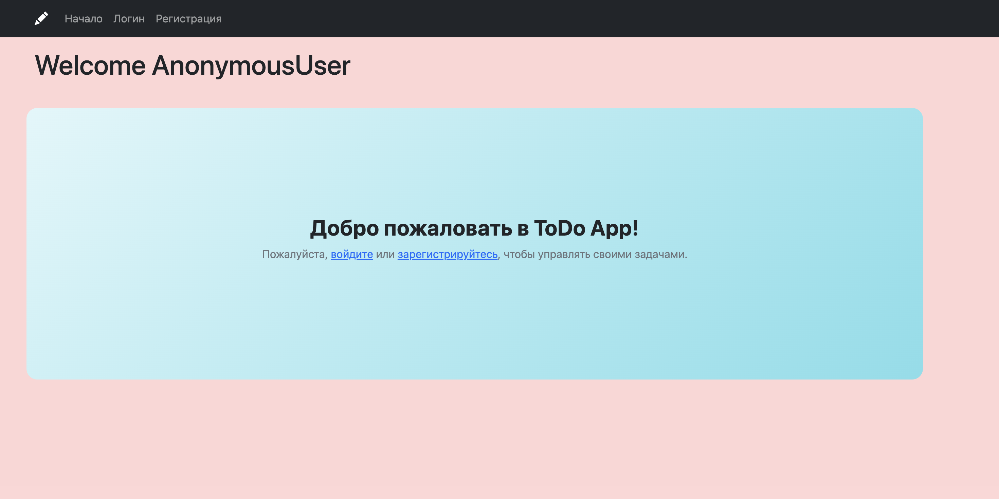
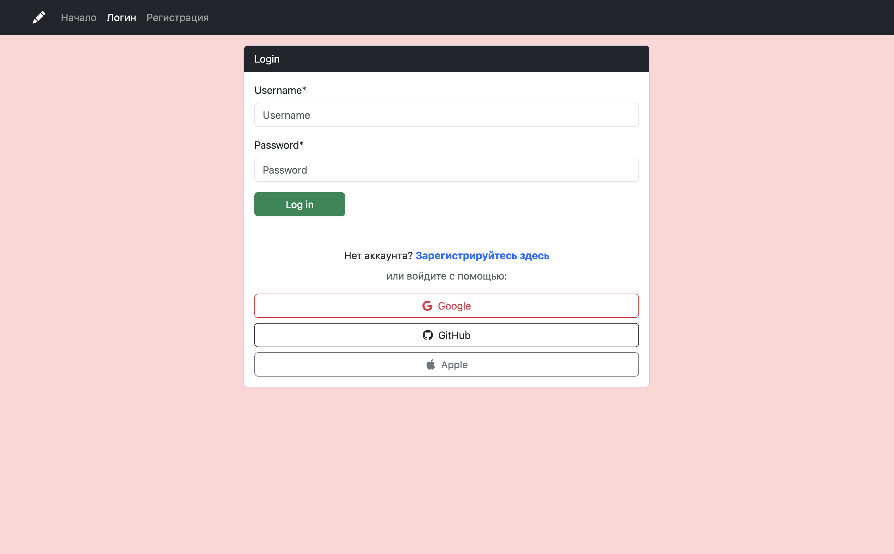
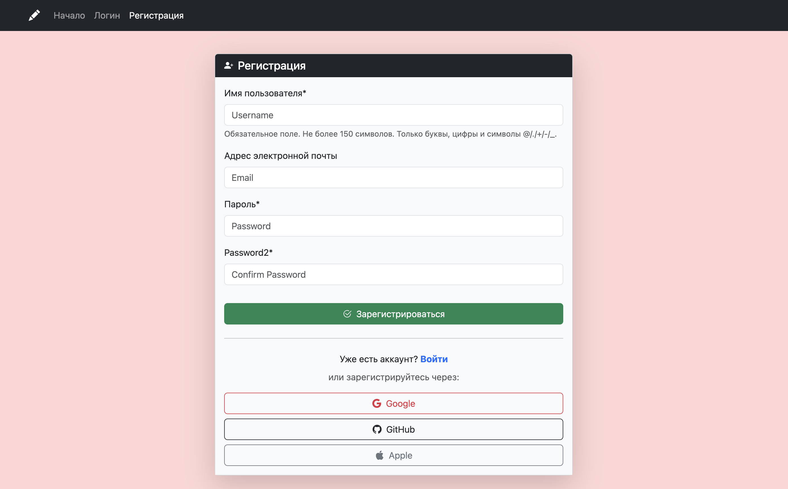

# 📝 Django TODO App (с Docker)

## Скриншоты

### 🏠 Главная страница


### 🔐 Страница логина


### 🔐 Страница регистрации



Простой To-Do проект на Django, упакованный с Docker и Docker Compose.  
Поддерживает регистрацию, авторизацию, CRUD задач и админ-панель.

---

## 🚀 Запуск проекта

### 1. Клонировать репозиторий

```bash
git clone https://github.com/quramboyev/to_do
cd to_do
```

### 2. Собрать и запустить контейнеры

```bash
docker-compose up --build
```

🐳 Проект будет доступен на: http://localhost:8000

### ⚙️ Используемый стек
🐍 Django 
🐬 MySQL 
🐳 Docker & Docker Compose
🔐 Аутентификация 
📝 CRUD задач

### 📁 Структура проекта

```bash
├── assets/            
├── config/
├──locale/
├──media/
├──static/
├──templates/
├──to-do/
├──todo_auth
├── manage.py
├── requirements.txt
├── Dockerfile
├── docker-compose.yml
└── README.md

```

🧑‍💻 Автор
Курамбоев Улугбек
